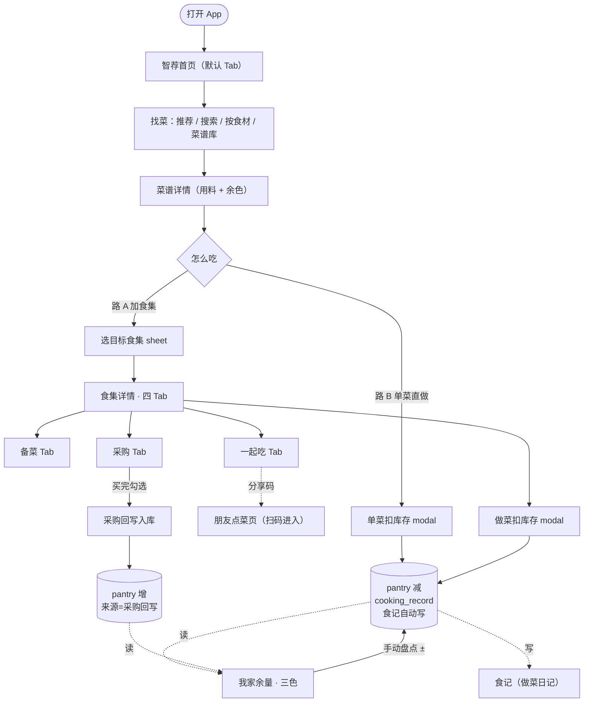
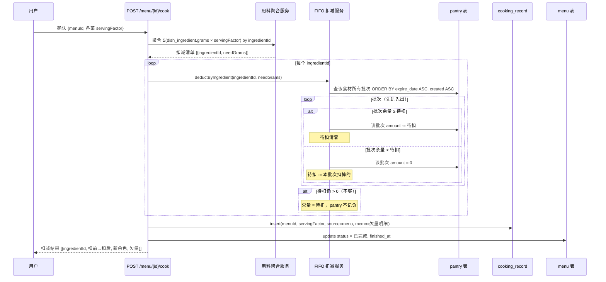
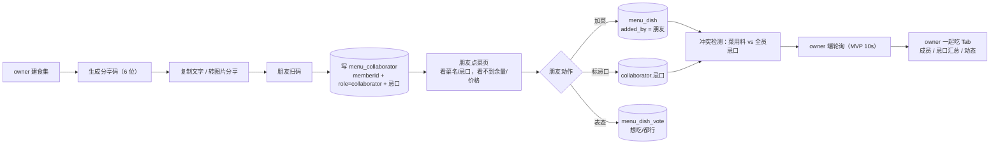
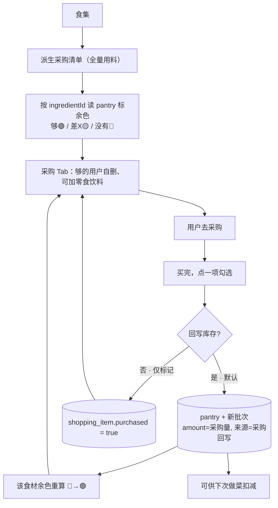
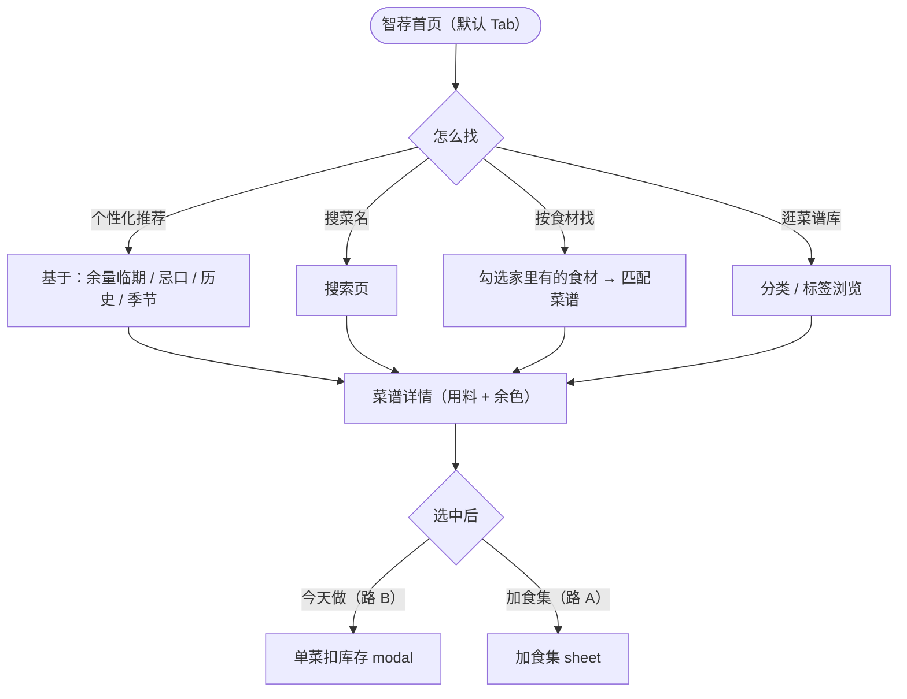

# 咕嘟小食单 · 核心动线原型设计 Spec

> **日期**：2026-07-02
> **范围**：食集这条线——找菜 → 加食集 → 做菜扣库存 → 列采购 → 回写余量
> **状态**：原型 10 屏画完、逐屏获批；待用户复核 → 转 writing-plans 出实施计划
> **关联**：`docs/redesign-audit.md`（后端 gap 评审）、`gudu-product-redesign.md`（产品决策存档）、`docs/superpowers/specs/2026-07-02-unit-conversion-design.md`（单位换算，已落地）

---

## 1. 背景与目标

**用户第一痛点**（`docs/咕嘟小食单改版文档.tx:13`）：「不知道该怎么设计消耗的流程，才能让家里的食材余量准确些」。

**重做主线**：以「一次饭 = 食集」为工作中心，把找菜 / 备菜 / 采购 / 做菜 / 余量串成一条动线，让做完一顿饭自动回写余量、余量又反过来决定下次采购要买什么。

**本次原型目标**：
1. 把核心动线点穿，细到「点哪个按钮、弹什么 modal、扣哪些数据」
2. 固化跨页稳定的铁律，避免实现时再被代码注释误导
3. 为 writing-plans 提供逐屏可拆的依据

**显式留后**：大容器「餐程（一段时间安排）」本次不画，原型只到食集层。

---

## 2. 业务流程图

```
┌─ 找菜（菜谱库 / 智荐）
│   └─ 菜谱详情页：选份数、看用料余色
│       ├─ 路 A「加食集」→ 弹 sheet 选目标食集 ─┐
│       └─ 路 B「今天做」→ 单菜直做 modal      │（轻流程，不入食集）
│                                              │
├─ 食集（一次饭的工作区）←──────────────────────┘
│   ├─ 菜 Tab：调份数 / 加备注 / 单道做或整集做
│   ├─ 备菜 Tab：全量用料聚合 + 备料状态 + 共用高亮
│   ├─ 采购 Tab：全量用料 + 余色 + 买完勾选 + 手动加项 + 分享导出
│   └─ 一起吃 Tab：成员 + 忌口汇总 + 分享码 + 活动流
│       └─ 朋友扫码 → 朋友点菜页（看菜名/忌口，看不到余量/价格）
│
├─ 做菜扣库存 modal（点「开始做这顿饭」）
│   └─ 按 ingredientId 聚合 × 份数，FIFO 扣 pantry，欠量记 cooking_record
│       └─ 写 cooking_record(menuId+servingFactor) + pantry 减量 + 食集→已完成
│
└─ 我家余量页（回写落点）
    └─ 三色展示扣减后状态 + 手动盘点纠正 + 空的进采购
```

**关键**：备菜与采购都在做菜**之前**（用户的原话校正：采购在做菜前面、备菜也在做菜前面）；做菜扣库存之后才回写余量。

### 2.1 产品总览动线（用户全旅程）



### 2.2 核心做饭动线 · 详细（含判断分支）

```mermaid
flowchart TD
    Start([选中菜谱]) --> Serv[选份数，看用料余色]
    Serv --> Decide{加入食集?}
    Decide -->|否 · 单菜直做| CookSingle["单菜 modal：该菜用料 + 扣减清单"]
    Decide -->是 · 加食集| PickMenu["选目标食集 / 新建"]
    PickMenu --> AddDish[("写 menu_dish\nserving_factor + 备注")]
    AddDish --> MenuPage["食集详情"]
    MenuPage --> Prep["备菜：全量聚合 + 备料状态 + 共用高亮"]
    MenuPage --> Shop["采购：全量 + 余色 + 够的自删 + 可加零食"]
    MenuPage --> Collab["一起吃：成员 / 忌口 / 分享码 / 活动流"]
    MenuPage --> CookBtn["点「开始做这顿饭」"]
    CookBtn --> CookModal["扣库存 modal：Σ 各菜用量 × 份数"]
    CookModal --> Enough{都够?}
    Enough -->|够| Deduct["FIFO 扣 pantry"]
    Enough -->|不够| Warn["警告 + 欠量明细"]
    Warn --> UserPick{用户选}
    UserPick -->|先采购| BackShop["回采购 Tab 补"]
    UserPick -->|强行做| Deduct
    Deduct --> WRec[("cooking_record\nmenuId + servingFactor + memo=欠量")]
    Deduct --> WPantry[("pantry 批次减量\n扣到 0，不记负")]
    WRec --> MenuDone["食集 → 已完成"]
    WPantry --> Refresh["我家余量 · 三色刷新"]
    CookSingle --> WRec
    CookSingle --> WPantry
```

### 2.3 做菜扣库存 · 数据流（生产级，含接口/表/循环）



### 2.4 协同点菜 · 状态流



### 2.5 采购 → 回写余量 · 闭环



> **未决**：买完勾选默认是否回写 pantry？倾向「默认回写 + 可关闭」，避免余量与实购脱节。见 §9。

### 2.6 找菜入口 · 决策树



---

## 3. 信息架构

### 3.1 三层容器（从小到大）

| 层 | 定名 | 是什么 | 例子 | 后端模块 |
|---|---|---|---|---|
| 小 | **菜谱** | 一道菜怎么烧（永久内容库） | 番茄炒蛋 | cookbook/dish |
| 中 | **食集** | 一次饭的工作区（可协同） | 今晚的饭、周日家宴 | menu |
| 大 | **餐程** | 一段时间的安排（**本次不画**） | 本周三餐、下周家宴 | mealplan |

> 「今晚的饭」是食集的一个**实例名**，不是与食集并列的概念。

### 3.2 5-Tab App 壳

| Tab | 定位 |
|---|---|
| 菜谱 | 找菜入口（库 / 搜索 / 分类） |
| 食集 | 一次饭的工作区列表 |
| **智荐** ✨（中心 FAB，默认首页） | AI 推荐今天吃啥 |
| 我家余量 | 三色库存 |
| 我的 | 账号 / 设置 |

### 3.3 命名系统（8 项定稿 + 本次订正）

| 概念 | 定名 |
|---|---|
| 一道菜怎么烧 | 菜谱 |
| 一次饭 | 食集 |
| 一段时间安排 | 餐程 |
| 家里剩啥 | 我家余量 |
| 要买啥 | 采购清单 |
| 原料库 | 食材 |
| 做菜日记 | 食记 |
| AI | 智荐 |

**本次订正**：食集详情第 4 个 Tab 原称「协同」，不在词表、偏办公风，改定 **「一起吃」**。功能本质不变（协同点菜）。原则：命名走文雅造词，但按钮/操作/描述保持口语接地气。

---

## 4. 页面设计（10 屏，逐屏）

> mockup 文件在 visual companion 两个 session 目录下：`.superpowers/brainstorm/{44829-1783002708,41263-1782996859}/content/`。下面每屏标文件名。

### 4.1 菜谱详情页（找菜落点 + 分叉入口）`dish-detail.html`

- **用途**：从菜谱库/智荐看中一道菜进来，确认份数、看用料家里够不够，做双流程分叉。
- **关键元素**：
  - Hero（菜图）+ 标签 + 做过 N 次
  - 份数选择器（默认 2 人份）
  - **用料 + 余色**：每项标 🟢够/🟡差X/🔴没有（进页就知道家里够不够）
  - Sticky 底部两按钮：**🍱 加食集** / **✨ 今天做**
- **分叉**：
  - 点「加食集」→ 弹 sheet：选目标食集（今晚的饭 / 周日家宴 / 新建）+ 备注忌口 → 确认加入
  - 点「今天做」→ 单菜直做 modal（轻流程，不入食集，直接写 cooking_record）
  - 已在食集中的菜再点「加食集」→ 提示「已加入，是否增加份数」（修 audit §6 的 factor 累加误操作）

### 4.2 食集生命周期 + 列表 `menu-lifecycle.html`

- **规则**：新建食集默认日期=今天、起个名；状态 进行中→已完成；过日期未做完自动标已过期移入历史（不删、可恢复）；主区只留 进行中+今天+近3天，更早折进「历史」。
- **列表卡片**顺带露进度：🛒采购 x/待买 · 🧄备菜 x/total。

### 4.3 食集详情 · 菜 Tab `menu-detail-cai.html`

- 食集头（名 + 状态 + 餐次）+ 四 Tab（菜/备菜/采购/一起吃）。
- **菜 Tab**：每道菜卡片（emoji+名+时长+价）+ 份数 ± + 备注（忌口/口味）+ 「今天做」单道入口 + ✕撤菜；底部「+加菜」+ Sticky「♨️开始做这顿饭·N道」。

### 4.4 食集详情 · 备菜 Tab `menu-detail-beicai.html`

- 全量用料按食材聚合（Σ各菜 DishIngredient × servingFactor）。
- 每项：**备料状态** chip（待备/✓已备/化冻中/腌制中），点切换、长按选化冻/腌制。
- **共用高亮**🔥：多道菜共用的食材高亮，显示「共需 X · 菜A+菜B」，一次备够。
- 调料折叠（盐/油/豉油 无需备料）。
- 进度条「已备 2 / 共 7 样」。
- **与采购的关系**：同源（都全量用料）、标记维度不同（备菜=备料状态，采购=余色+购买状态），平行兄弟 Tab 互不串联。

### 4.5 食集详情 · 采购 Tab `menu-detail-caigou-v2.html`

- **全量铁律**：全量用料平铺一行行列出（不分段），行尾标余色 🟢够/🟡差X/🔴没有。
- 够的（盐/油/豉油）**系统不自动剔除**，标绿在列、用户自己 ✕ 删。
- **买完勾选**：勾后置灰划线（鲈鱼示例），不消失。
- **手动加项**：能加零食/饮料/生活用品（edible 字段，标「手动加」黄底）。
- **汇总条**：共 N 项 · 已买 X。
- **分享/导出**：底部「📋复制文字 / 🖼转图片分享」+ 顶栏图标（满足改版文档 line 18）。

### 4.6 食集详情 · 一起吃 Tab `menu-detail-xietong.html`

- **成员区**：owner（👑）+ 协作者头像 + 邀请位。
- **忌口汇总卡**：列出成员忌口，系统自动检查食集里的菜有无冲突（✓全避开 或 ⚠️撞了）。
- **分享码**：6 位码 + 复制（朋友扫码加入能点菜+标忌口）。
- **活动流**：谁加了菜、谁标了忌口、谁建了食集。
- **朋友视角红线**（底部）：看得到 菜名/忌口/备注；**看不到 我家余量/价格**。

### 4.7 朋友点菜页 `friend-pick.html`

- 朋友扫码进入的独立页（非 owner 视角）。
- **我的忌口 banner**（可编辑）：系统自动帮你避开。
- 已选菜列表：每道表态 👍想吃/都行；**撞忌口的菜红框+红标**+「含XX会过敏，建议跟主人说换掉」。
- 「+我想吃这道」→ 搜索加菜 sheet：推荐列表**自动避开 ta 的忌口**；撞忌口的菜默认藏起、可展开；加的菜在食集标「XX加的」，owner 可 ✕ 撤。

### 4.8 做菜扣库存 modal `cooking-deduct-modal.html`

- 触发：点「开始做这顿饭」（整集）或单道「今天做」。
- **确认前 modal**：各菜份数（只读，改回菜 Tab）+「将按食材扣我家余量·FIFO 先扣旧的」清单（每项 扣X·家里Y + 余色 chip）+ 不够红警告 + 两按钮「🛒先采购 / ♨️强行做扣到0」。
- **确认后反馈**：✓做菜记录已写入 + 食集→已完成 + 我家余量已更新（每项 扣前→扣后 + 新余色）+ 欠量提醒（葱3/菠菜2/番茄2 没扣成）。
- **扣减规则**：按 ingredientId 聚合各菜用量（份数 × DishIngredient），FIFO 先扣 pantry 最早批次；不够的**扣到 0 为止、不让 pantry 变负**，扣不动的欠量写 cooking_record.memo。
- > **单菜直做（路 B）modal**：是 4.8 的简化版——只列单道菜的扣减清单 + 份数选择，不涉及食集状态流转、不写 menuId；扣减规则、欠量处理、FIFO 全同 4.8。UI 复用 4.8 的弹层结构。

### 4.9 我家余量页 `pantry-page.html`

- 动线闭环终点。三色库存（🔴缺/🟡偏低/🟢够）。
- 顶部闭环提示条「刚做完『今晚的饭』·5样扣到空，去采购补？」直接打通回采购。
- **三色汇总比例条** + 筛选（全部/缺/低/够）+ 按状态分组列表（缺的在上）。
- 每项：现量 + 余色 + **上次变动来源**（做菜-X·刚刚 / 采购+X / 盘点 / 本来就没有）+ ± 快速盘点。
- **手动盘点弹层**（点 ±）：大数字调整实际数；**批次明细（FIFO）**展示每笔批次去向；保存记一笔「盘点±X」。

### 4.10 智荐首页（找菜入口总枢纽）`home-aisho.html`

- 默认 landing（5-Tab 智荐 FAB✨ 高亮）。
- **主推荐卡**（临期驱动）：「你家鸡蛋还剩 3 天 → 番茄炒蛋」+ 今天做/加食集两按钮。
- 副推荐横滑：季节鲜、你常做。
- **找菜四宫格**：搜菜名 / 按食材找 / 逛菜谱库 / 拍照识菜。
- 最近做过快捷入口。
- **智荐 4 条触发线**：余量临期 / 季节时令 / 历史偏好 / 忌口规避。

### 4.11 菜谱库 + 搜索 + 按食材找 `cookbook-search.html`

- **菜谱库**：搜索框 + 分类 Tab（全部/家常/快手10分/宝宝/低盐）+ 排序（做过最多/最近/最快）+ 列表，每道标 **「家里够 X/Y 样」余色**。
- **按食材找**：勾选家里有的食材（从 pantry 自动带入）→ 匹配菜谱，按「缺的在上」排序，每道标 够X/X、差N、缺XX。支持**多选一次加几道到目标食集**。
- 余色贯穿找菜全程，不用进详情就知道要不要采购。

### 4.12 采购回写 · 买完入库闭环 `shopping-restock.html`

- 触发：采购 Tab 里点某项「已买」。
- **入库确认 modal**：实际买了多少（±可调，默认=清单量）+ 批次属性（入库日期/存放位/保质期）+ 单价（选填）+ **回写我家余量开关（默认开）**。
- 两按钮：「📥入库」（回写 pantry，加新批次） / 「只标已买」（代买等不入库场景）。
- **入库后**：该食材余色 🔴→🟢 刷新；采购项标「已入库」；提示「FIFO 先扣这批」。
- 闭环意义：买完不止打勾，而是入库→pantry 加批次→余色重算→下次做菜先扣，保证余量准。

### 4.13 食记 · 做菜日记回看 `dailylog.html`

- 从 cooking_record 自动生成（做菜扣库存时写，不用手记）。
- **统计卡**：本月做了几顿 / 最常做的菜 / 食材花费。
- 时间轴（按日）/ 按菜汇总 两种视图；每条记「N 道 · M 人份 · 扣 X 样 · 欠 Y 样」。
- **单条详情**：做了哪些菜 + 扣减明细 + 欠量明细 + 备注。
- **「🔁 再做一次」**：复制那次的菜+份数建新食集，重新走流程。

### 4.14 食材管理（App 端）`ingredient-manage.html`

- App 端用户视角管「我常用的食材」（全局标准库在 admin 端，运营维护）。
- 列表：分类 Tab（蔬菜/肉蛋/调料/饮料零食/生活用品），每项标 **换算是否已设**（没设的标黄「换算待补」）。
- **编辑页**：默认单位 + **单位→克换算表**（ingredient_unit_gram，可多条：1个=50g / 1盒=500g / 1斤=500g）+ 余量警戒阈值（< N → 🟡偏低）+ 单价 + **edible 标记**（食用/饮料零食/生活用品，影响是否算营养行）。
- 换算是地基：没设的食材（如菠菜）扣减/余色/价格都算不准。

---

## 5. 跨页铁律（实现时必须守住）

1. **先有食集后有清单**：采购清单从食集派生，非凭空建；ShoppingItem 记 `sourceMenuId` 溯源（修 audit §9）。
2. **采购全量不减库存**：采购 Tab 拉全量用料、每项标余色，**够的用户自己删、系统不剔**；采购不扣 pantry（修 audit §2 澄清）。
3. **备菜 ≠ 采购**：同源全量用料，标记维度不同（备菜=备料状态，采购=余色+购买状态），平行兄弟 Tab 互不串联。
4. **双轨三色库存**：auto 扣减（做菜按 DishIngredient 扣）+ 手动盘点（纠正偏差）；红缺/黄偏低/绿够，阈值走 Pantry.lowThreshold。
   > **两个「三色」别混**：采购 Tab 的余色是**相对这次做菜够不够**（🟢够/🟡差X/🔴没有）；我家余量页的三色是**绝对库存健康度**（🔴缺/🟡偏低/🟢够）。维度不同、判定函数不同，不要共用一套逻辑。
5. **扣减 FIFO 不记负**：按 ingredientId 聚合多条 pantry，先进先出；扣到 0 为止，欠量写 cooking_record.memo，**pantry 永不为负**（修 audit §5）。
6. **食集生命周期**：日期+状态，过期自动归档不删、可恢复；主区只留在用的。
7. **朋友视角红线**：看菜名/忌口/备注/加菜/表态；**看不到余量/价格/采购/备菜**（主人私事）。
8. **单位换算**：克基准，`ingredient_unit_gram` + `UnitConvertService`，三处保存接入 + 菜单价格按用量算（**✅ 已落地**，见 unit-conversion plan）。

---

## 6. 数据模型与接口

### 6.1 已有表（复用）

- `dish` / `dish_ingredient`（菜谱与用量）
- `menu` / `menu_dish`（食集与菜品关联，**待加** `serving_factor` + `ingredient_overrides` JSON）
- `pantry`（按批次存的余量，含 `low_threshold`/`expire_date`）
- `shopping_list` / `shopping_item`（采购，`shopping_item.reference_grams` 已预留）
- `cooking_record`（做菜记录，**待加** `menu_id` + `serving_factor` + `source` 字段）
- `ingredient` / `ingredient_unit_gram`（原料 + 单位换算，**已落地**）

### 6.2 新增表

- `menu_prep_status`（备菜备料状态：menuId + ingredientId + status[待备/已备/化冻/腌制]）
- `menu_collaborator`（食集协作者：menuId + memberId + role[owner/collaborator] + 忌口）

### 6.3 接口清单

| 接口 | 状态 | 说明 |
|---|---|---|
| `GET /menu/{id}/ingredients-overview` | 待建 | 用料总览（备菜+采购同源只读） |
| `GET /menu/{id}/prep` / `PUT /prep/{ingredientId}` | 待建 | 备菜状态 |
| `GET /menu/{id}/shopping`（全量+余色） | 待改 | 现版不读 pantry，要按 ingredientId 聚合标余色 |
| `POST /menu/{id}/cook` | 待建 | 做菜扣库存（聚合扣减 + 写 cooking_record + 食集→已完成） |
| `POST /dish/{id}/cook-now` | 待建 | 单菜直做（轻流程，不入食集） |
| `GET /pantry/three-color` | 待改 | 三色汇总 + 按 ingredientId 聚合 |
| `POST /pantry/{id}/adjust` | 已有 | 手动盘点（已有 deduct，补 add/adjust） |
| `GET /menu/{id}/collaborator` / 分享码 | 待建 | 一起吃 |
| `GET /shopping/{id}/export`（文字/图片） | 待建 | 分享导出 |
| `GET/PUT /ingredient/{id}/unit-grams` | **已有** | 单位换算编辑 |

---

## 7. 后端 Gap（引自 `docs/redesign-audit.md`，标状态）

### P0（阻塞核心动线）

| # | gap | 状态 |
|---|---|---|
| ① | 单位换算服务（克基准） | **✅ 已落地**（B，6 commit） |
| ② | auto 扣减触发链（cooking_record→pantry）+ 多批次 FIFO + cooking_record 加 menuId/servingFactor | ❌ 待建 |
| ③ | 采购清单全量 + 余色标记（按 ingredientId 聚合 pantry） | ❌ 待建 |
| ④ | 备菜模块（menu_prep_status 表 + GET/PUT） | ❌ 待建 |

### P1

| # | gap | 说明 |
|---|---|---|
| ⑤ | servingFactor 累加误操作（§6） | 加菜时按 dishId 聚合 + 提示 |
| ⑥ | markDone 无份数/无防误触/无幂等（§7,§8） | 份数入参 + 确认 + 去重 |
| ⑦ | 采购溯源缺 sourceMenuId（§9） | 加字段 |
| ⑧ | 分享/导出（文字/图片）（§10） | 新接口 |
| ⑨ | MenuDish 语义歧义（§11） | 协同去重规则 |
| ⑩ | 价格按用量计算的单位换算兜底（§12） | 依赖①，已有雏形需校验 |

---

## 8. 范围边界

### In scope（本次原型覆盖）
- 找菜 → 加食集 → 备菜 → 采购 → 做菜扣库存 → 回写余量 全链路
- 食集详情四 Tab（菜/备菜/采购/一起吃）
- 朋友点菜页（协同点菜 MVP）
- 做菜扣库存 modal（双流程：整集做 + 单菜直做）
- 我家余量页（三色 + 手动盘点）
- 找菜入口段（智荐首页 + 菜谱库/搜索/按食材找）
- 采购回写入库闭环（买完→入库→余色刷新）
- 食记页（做菜日记回看 + 统计 + 再做一次）
- 食材管理（App 端：单位换算 / 余量阈值 / edible 标记）

### Out of scope（留后）
- **餐程**（大容器，一段时间安排）
- 智荐算法（RAG/向量）——本次只占位 Tab + FAB，算法留后
- 营养计算（IngredientNutrition，食材 edible 标记已预留）
- admin 端改造
- 朋友加菜审批流（当前：直接进，owner 可 ✕ 撤）
- SSE/WebSocket 实时协同（当前 MVP：10s 轮询）

---

## 9. 未决问题（转 writing-plans 前可再确认）

1. **扣减欠量落地位置**：当前倾向写 `cooking_record.memo`（不污染 pantry）；是否需要单独 `stock_shortage` 表？—— MVP 先 memo。
2. **朋友加菜审批**：当前直接进食集、owner 可撤；若噪音大再加审批门。
3. **余色阈值**：偏低=低于 lowThreshold，空=0；中间值（如 1 个鸡蛋）算偏低还是够？—— 按 lowThreshold 判，1<阈值=黄。
4. **食集过期判定时机**：定时任务每天 0 点扫，还是打开 App 时懒判？—— MVP 懒判（打开食集 Tab 时扫一次）。
5. **餐程何时启动**：本次留后，等食集线跑通。
6. **食集完成后是否冻结**：已完成/已过期的食集还能加菜、改份数吗？—— MVP 倾向「已完成=只读」，要改就「复制建新食集」。
7. **采购回写默认行为**：买完勾选默认「📥入库回写」还是「只标已买」？倾向默认回写（保证余量准），但提供关闭入口（代买/不入自家库）。对应流程图 §2.5。
8. **拍照识菜 / 智荐算法**：本次只占位入口；智荐先走规则+标签过滤，RAG/向量留后；拍照识菜（图像识别）P2。

---

## 10. 下一步

本 spec 用户复核通过后 → 转 `writing-plans`，按 P0 顺序拆实施 task：
①已完 → ②auto扣减链 → ③采购余色 → ④备菜模块 → P1 逐条。
